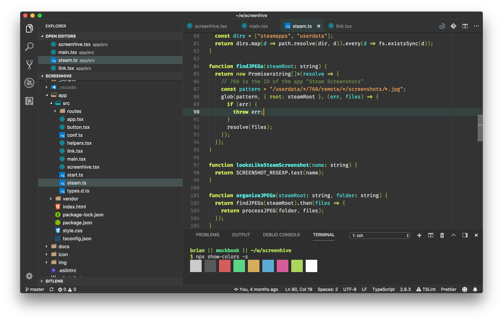
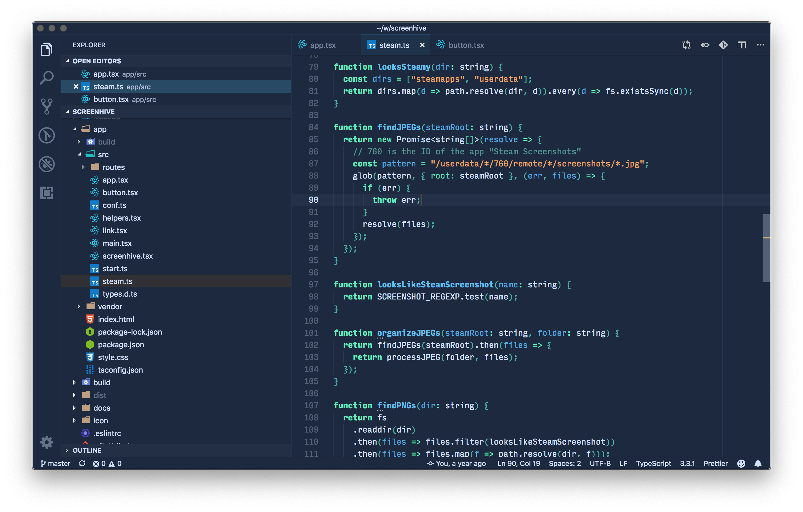
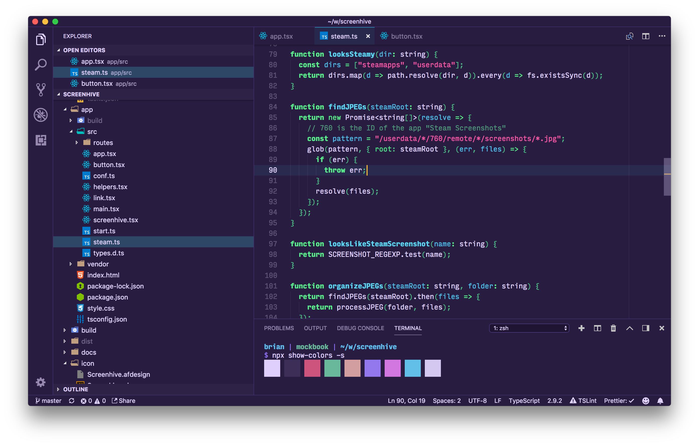
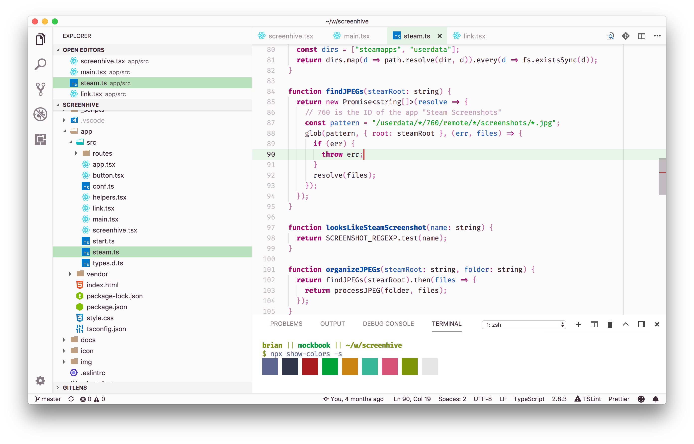
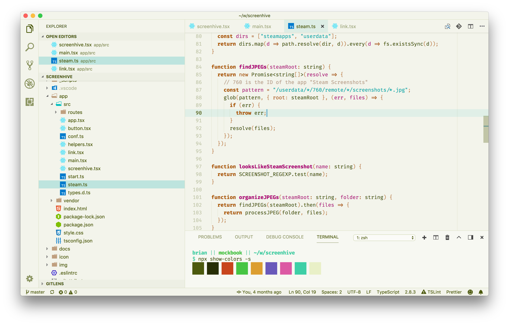
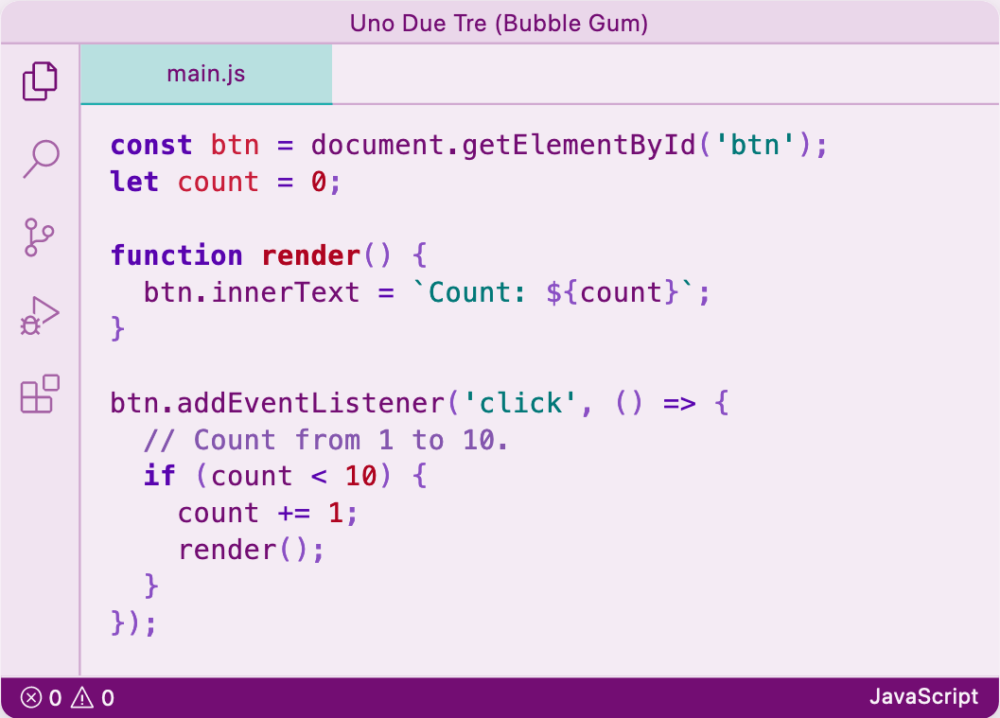

# Uno Due Tre

_Uno Due Tre_ ("one two three" in Italian) is a color scheme inspired by
Duotone, but featuring three colors instead of two. I really **really** like
strings to stand out in my source code, so those get a special third color.

There are several styles in both light and dark varieties to suit differing
tastes.

## Dark

## Ocean

## Midnight

## Light

## Nature

## Bubble Gum

