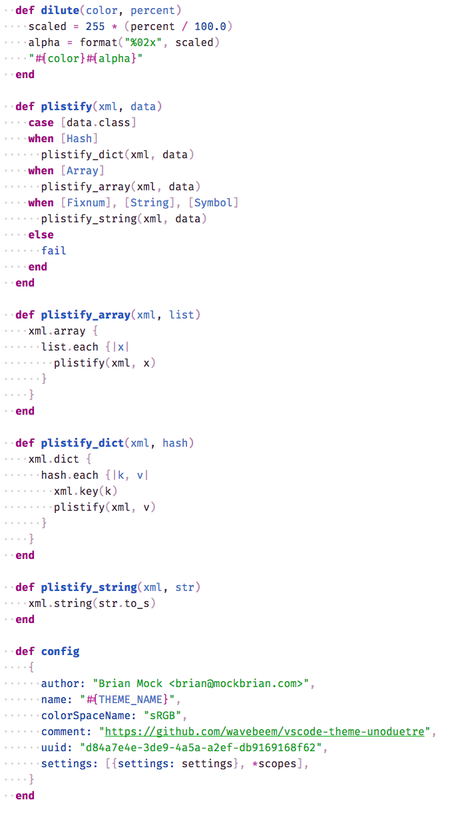

# Uno Due Tre

*Uno Due Tre* ("one two three" in Italian) is a color scheme inspired by Duotone, but featuring three colors instead of two. I really **really** like strings to stand out in my source code, so those get a special third color. Enjoy!

