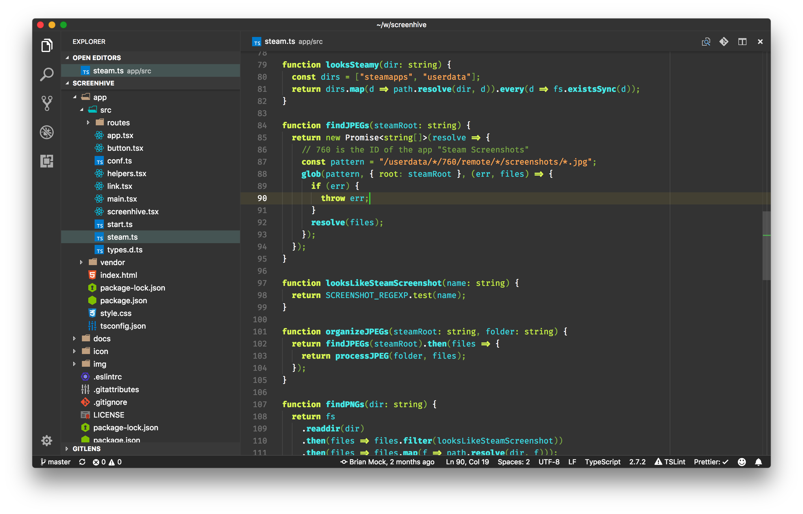
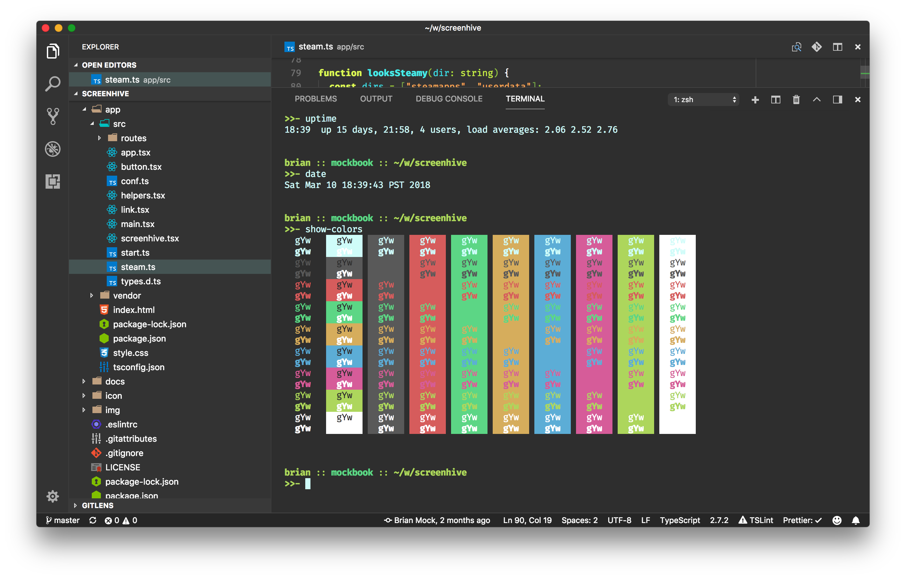
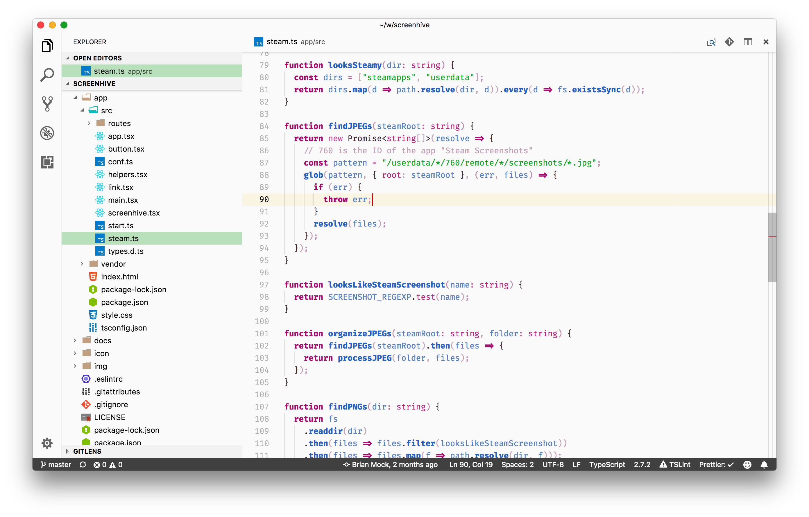
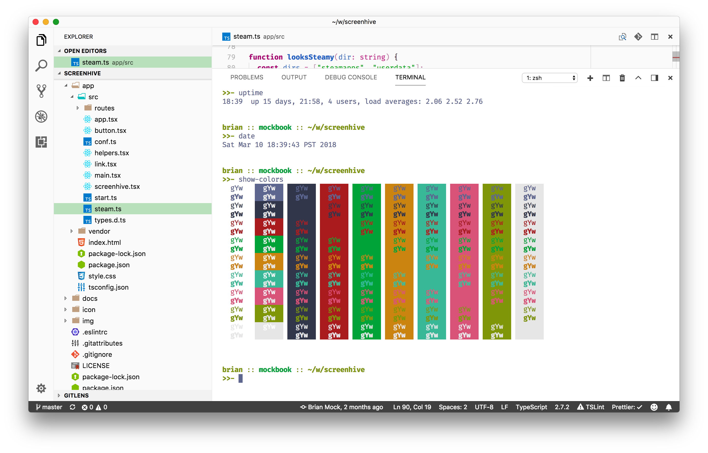

# Uno Due Tre

_Uno Due Tre_ ("one two three" in Italian) is a color scheme inspired by Duotone, but featuring three colors instead of two. I really **really** like strings to stand out in my source code, so those get a special third color.

It includes a light version and a dark version. Enjoy!

## Dark

## Light

